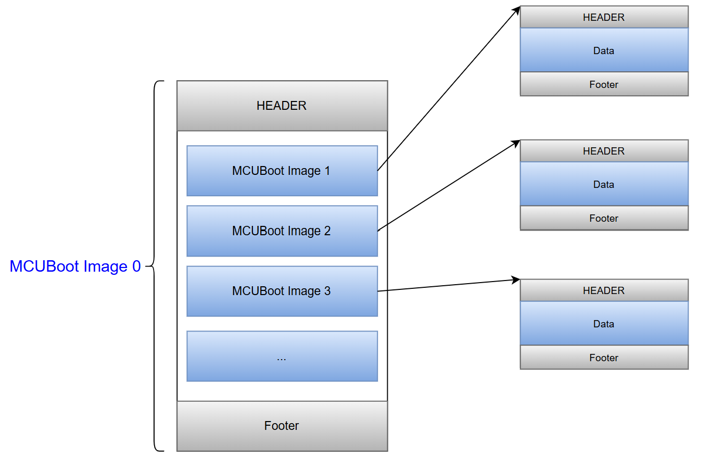

# [combine_images Extensions to MCUboot for Multi-Core SoC Image Distribution](#combine_images_for_multi-core_SoC_image_distribution)

In multi-core system-on-chip based platforms, each processor core typically runs separate firmware 
as every core may have distinct responsibilities. Packaging and distributing firmware images for
these systems presents a challenge as multiple independent images must be bundled, versioned, and
delivered as a single update while preserving the ability to secure and authenticate each image. The
combine_images extensions to MCUboot allow for the bundling and distribution of multiple images
together as an MCUboot AppPack.

# [AppPack Structure](#apppack_structure)

The purpose of this method to handle multiple images in a single image pack is to decrease the number
of signature checks required during bootup. An example AppPack layout is shown in the image below.
This example contains the standard MCUboot header and trailer surrounding a number of images. Each
of the enclosed images may itself be an AppPack. 

# [AppPack Generation](#apppack_generation)

## [combine_images.py](#combine_images.py)

In order to generate an AppPack you will need to call the combine_images.py script.

    Usage: python combine_images.py --config [yaml file] --imgtool [path to imgtool] --output [output directory]

    Options:
      --config [yaml file]            yaml file specifying content of the AppPack to 
                                      be generated.  The yaml file will specify input
                                      binaries, output file names and the path to any 
                                      signing keys.
      --imgtool [path to imgtool]     Path to ImgTool which can be either a python file
                                      or binary.  The provided ImgTool is called to 
                                      package binaries and create an AppPack structure
                                      defined according to the specified yaml file.
      --output [output directory]     Path to an directory which will be used to store
                                      any intermediary file products and the final
                                      AppPack itself.

## [combine_images.yaml](#combine_images.yaml)

The combine_images.py script requires a yaml config file to define the layout of the desired AppPack.
The structure of the yaml file is shown below.  In this example there is a top level AppPack which 
may or may not contain an inputfile.  The top level AppPack may also contain some number of nested
AppPacks which can contain additional AppPacks itself.

    [AppPack Name]_pack:
      # Optional: top-level infline can be omitted if not needed
      infile: [filename]

      # Required
      outfile: [filename]
      params: [imgtool parameter string]

      [Nested AppPack Name]_pack:
        infile: [filename]
        outfile: [filename]
        params: [imgtool parameter string]
