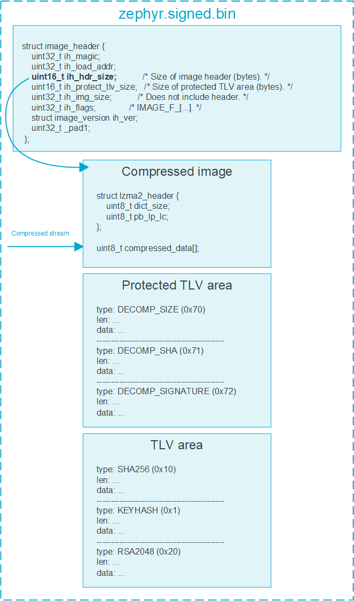

# Compressed binary file internals

This article describes the structure of the
`zephyr.signed.bin` file when image
compression is enabled. You do not need to know these details to use the
image compression subsystem, but they can be beneficial if you want to
use them for verification or custom integration purposes.

For an example, see the following structure of the file:



## [LZMA Header](#LZMA-Header)

The Lempel-Ziv-Markov chain Algorithm (LZMA) header is crucial for files
compressed using the LZMA method. It contains metadata essential for
decompression. The `lzma2_header` encodes compression parameters using
two bytes.

### [Calculating compression parameters](#Calculating-compression-parameters)

Compression parameters can be calculated, retrieved, or changed
depending on your needs. For details, see the following sections.

#### [Default values](#Default-values)

Compression parameters have the following default values:

-   `dict_size`: 131072
-   `pb`: 2
-   `lc`: 3
-   `lp`: 1

#### [Adjusting dictionary size](#Adjusting-dictionary-size)

You can calculate the `dict_size` using the following method:

```c
unsigned int i = 0;

for (i = 0; i < 40; i++) {
    if (raw_dict_size <= (((uint32_t)2 | ((i) & 1)) << ((i) / 2 + 11))) {
        break;
    }
}
dict_size = (uint8_t)i;
```

With this method, `dict_size` can have one of the following values:

 |Hex Value  |  Size      |
 |-----------|------------|
 |0x00       | 4096       |
 |0x01       | 6144       |
 |0x02       | 8192       |
 |0x03       | 12288      |
 |0x04       | 16384      |
 |0x05       | 24576      |
 |0x06       | 32768      |
 |0x07       | 49152      |
 |0x08       | 65536      |
 |0x09       | 98304      |
 |0x0a       | 131072     |
 |0x0b       | 196608     |
 |0x0c       | 262144     |
 |0x0d       | 393216     |
 |0x0e       | 524288     |
 |0x0f       | 786432     |
 |0x10       | 1048576    |
 |0x11       | 1572864    |
 |0x12       | 2097152    |
 |0x13       | 3145728    |
 |0x14       | 4194304    |
 |0x15       | 6291456    |
 |0x16       | 8388608    |
 |0x17       | 12582912   |
 |0x18       | 16777216   |
 |0x19       | 25165824   |
 |0x1a       | 33554432   |
 |0x1b       | 50331648   |
 |0x1c       | 67108864   |
 |0x1d       | 100663296  |
 |0x1e       | 134217728  |
 |0x1f       | 201326592  |
 |0x20       | 268435456  |
 |0x21       | 402653184  |
 |0x22       | 536870912  |
 |0x23       | 805306368  |
 |0x24       | 1073741824 |
 |0x25       | 1610612736 |
 |0x26       | 2147483648 |
 |0x27       | 3221225472 |

#### [Calculating literal context, literal pos, and pos bits](#Calculating-literal-context-literal-pos-and-pos-bits)

The second byte of the `lzma2_header` carries the following parameters:

-   `lc`, which specifies a number of literal context bits

-   `lp`, which specifies a number of literal pos bits

-   `pb`, which specifies a number of pos bits

    These parameters are encoded with the following formula:

    ```c
    pb_lp_lc = (uint8_t)((pb * 5 + lp) * 9 + lc);
    ```

    To decode these values from the combined `pb_lp_lc` byte, run the
    following code:

    ```c
    lc = pb_lp_lc % 9;
    pb_lp_lc /= 9;
    pb = pb_lp_lc / 5;
    lp = pb_lp_lc % 5;
    ```

## [Extracting LZMA stream from image](#Extracting-LZMA-stream-from-image)

To extract and decompress the LZMA stream from the image, follow these
steps:

1.  Determine the offset of the compressed stream by adding the
    `lzma2_header` size and the value stored under
    `image_header.ih_hdr_size`. For the size of the compressed stream,
    see `image_header.ih_img_size`.
2.  If the compressed stream is isolated and stored in a file named
    `raw.lzma`, you can perform
    decompression using the following commands:

 -   Without an ARM thumb filter:

     ```bash
     unlzma --lzma2 --format=raw --suffix=.lzma raw.lzma
     ```

 -   With an ARM thumb filter:

     ```bash
     unlzma --armthumb --lzma2 --format=raw --suffix=.lzma raw.lzma
     ```

Once the command is executed you will see a newly created file named
`raw`, which is identical to the
image before compression.

## [TLVs](#TLVs)

The following Type-Length-Values (TLVs) are used in the context of
decompressed images:

-   `DECOMP_SIZE (0x70)`: Specifies the size of the decompressed image.
-   `DECOMP_SHA (0x71)`: Contains the hash of the decompressed image.
-   `DECOMP_SIGNATURE (0x72)`: Holds the signature of either the hash or
    the entire image.

These TLVs are placed in the protected TLV section, ensuring they are
included in the hashing and signature calculations during the
verification process. The process for choosing the type of cryptographic
signature and hash algorithm used for securing the image is the same,
regardless of whether the image has undergone compression.

## [Sample](#Sample)

For practical implementation, you can find a simple stand-alone
verification program under the following path
`bootloader/mcuboot/samples/compression_test/independent_cmp.c`

This program demonstrates how to independently verify the integrity and
authenticity of a decompressed image using the specified TLVs.
