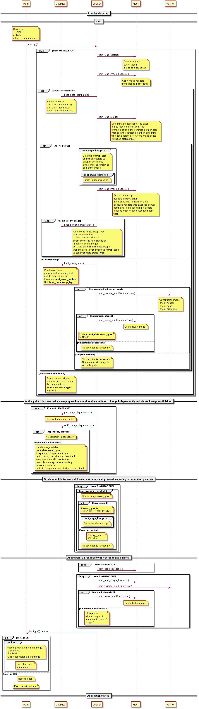

fragmentation- Feature Name: Multiple Image Support
- Start Date: 2018-07-06
- RFC PR:

# Summary
Firmware for ARMv8-M MCUs are often released in two separate binary images:
  - secure code
  - non-secure code

Currently MCUBoot can only handle single firmware image. MCUBoot could be
extended to handle the secure and non-secure binaries in one single blob and do
the upgrade of the images in one round.
This single blob approach has some drawbacks:
  - It always needs to update both images even if one of them has not changed.
  - In multi vendor scenario it requires to share the firmware images among the
    parties. Because the concatenated firmware must be signed by that vendor,
    who has access to the private key.
  - If the flash memory of the MCU is not contiguous then it just does not work.
  - In most of the cases there is padding between the images which is always
    copied during swap or overwrite, which is an overhead. The smaller the
    free space is between the images the less the overhead is.

In some use cases it can be desired to update them independently:
  - Only one of the binaries have changed (i.e.: bug fix). Downloading only the
    necessary binary uses less power.
  - The two binaries might be owned by different vendors. They can be in charge
    to decide when and what to update.
  - Address the non contiguous memory scenario.
  - Reduce overhead during update, only swapping necessary part of the flash.

Some difficulties, questions that come up with independent update:
  - API compliance must be ensured between images to avoid interoperability
    issues.
  - Dependency between images must be described, which covers the API alignment
    issue.
  - Ensure atomic update when both images must be updated in one go, and
    firmware cannot be started before updating of both images has properly
    finished.
  - In case one of the images needs to be reverted, it might be necessary to
    revert the other one as well due to API incompatibilities.
  - Flash will be more fragmented, as two memory slots are needed for each
    image.
  - Whether to use shared scratch area between images or use dedicated scratch
    area per image?
  - Whether to support image revert at all?

# Assumptions and restrictions
  - The proposed process is designed to work with more than two images.
  - MCUBoot does the updates and authentication of all image, and if all checks
    pass, it boots the image from primary slot of the 0th position.
  - Other image in the boot chain is started by previous image.
  - This proposal extends the current TLV manifest format. IETF manifest format
    was out of scope.
  - Revert feature of MCUBoot is also supported for multiple images.

# Terminology and slot layout
  - Header: image header
  - Payload: image itself
  - Manifest: contains TLV entries(image hash, key hash, signature, etc.)
  - Image trailer:
    - Swap status: progress info during swapping
    - Swap state:  `struct image_trailer`

The order of the items described above also represents the memory layout of a
single slot. There can be some gaps (which is padded) between the following
elements:
  - header - payload: vector table must be on aligned address
  - manifest - image trailer: image is smaller then memory slot

```
  +----------------------+
  | Header               |   <- struct image_header
  +----------------------+
  | Payload              |   <- image
  +----------------------+
  | Manifest             |   <- TLV entries
  +----------------------+
  | Unused space in slot |   <- Filled with 0xFF
  +----------------------+
  | Trailer              |
  | +------------------+ |
  | | Swap status      | |   <- Progress info
  | +------------------+ |
  | | Swap state       | |   <- struct image_trailer
  | +------------------+ |
  +----------------------+
```
# Describing dependency
As David Brown suggests the dependency between images can be described with
additional TLV entries in the manifest.
``` c
#define IMAGE_TLV_DEPENDENCY  0x40   /* image depends on other image */

#define IMAGE_CNT 2 /* Platform dependent, how many individual images are there
                     */
struct image_version {
   uint8_t iv_major;
   uint8_t iv_minor;
   uint16_t iv_revision;
   uint32_t iv_build_num;
};

struct image_dependency {
    uint32_t image_id;  /* For simplicity could be just numbering from 0 to
                         * IMAGE_CNT
                         */
    struct image_version image_min_version;  /* Indicates at minimum which
                                              * version of which firmware must
                                              * be available to satisfy
                                              * compliance
                                              */
};
```

*Note: IETF manifest proposal suggest to use exact hash value instead of version
number to describe dependency*

In the manifest section can be more then one dependency entry, but in practice
if the platform only supports two individual images then there can be maximum
one entry which reflects to the other image. I.e.: Non-secure image can be
dependent on secure image and vice versa.

Dependency is a mutual relation. If one image depends on an other then that
other image also depend on the first one. Therefore in case of dependency there
must be one dependency entry in both images manifest in order to ensure proper
updates.


Table about describing dependency:

|Image 0 version|Comment|Dependency entry||Image 1 version|Comment|Dependency entry|
|---------------|-------|---------------|-------|
|1.0.0.0|First release|2.0.0.0||2.0.0.0|Second release|1.0.0.0|
|1.0.0.1|Bug fix|2.0.0.0||2.0.0.0|no change|1.0.0.0|
|1.0.0.2|Bug fix|2.0.0.0||2.0.0.0|no change|1.0.0.0|
|1.1.0.0|API change|2.1.0.0||2.1.0.0|API change|1.1.0.0|
|1.1.0.0|no change|2.1.0.0||2.2.0.0|Security patch|1.1.0.0|
|1.1.0.1|Bug fix|2.2.0.0||2.2.0.0|Security patch|1.1.0.0|

`Note: Might be this double linked dependency handling can be replaced with
something simpler, i.e.: single linked. That case should be a main image, which
has no dependency and other images can depend only on previous image in the
chain.`

# How to include dependency entries?
In case of a single vendor, who owns all the images but still want to do
independent updates for example to save power, to including dependency entries
as a TLV is pretty easy. Only the scripts should be modified.

In case of multi vendor scenario when the device maker/owner only owns the main
application and other SW images is provided by other party, then it might, not
straight forward to ask the other party to include my main application's version
to his image as a TLV entry. Might be TLV entries must be extended by device
owner and that part should be signed his own key?

# Integrity protection of manifest
Currently the image manifest is not needed to be part of the integrity protected
section. There is no security vulnerability that could be exploited by modifying
it. It contains these TLV entries:
  - Image hash
  - Key hash
  - Signature (hash based)

```
  +--------------------+
  | Header             |   <- struct image_header
  +--------------------+
  | Payload            |
  +--------------------+
  | Manifest           |
  | +----------------+ |
  | | Manifest header| |   <- struct image_tlv_info
A | +----------------+ |
  | | SHA256 hash    | |   <- hash of header and payload (struct image_tlv)
B | +----------------+ |
  | | Keyhash        | |   <- indicates which public key for sig (struct image_tlv)
  | +----------------+ |
  | | Signature      | |   <- signature from A - B(struct image_tlv), only hash
  | +----------------+ |
  +--------------------+
```

But if manifest will be expanded with more info, then manifest itself required
to be integrity and authenticity protected. The easiest solution described
below, it was proposed by David Brown. There were alternatives. I chose, which
has less code impact.

```
  +--------------------+
  | Header             |   <- struct image_header
  +--------------------+
  | Payload            |
  +--------------------+
  | Manifest           |
  | +----------------+ |
  | | Manifest header| |   <- struct image_tlv_info
A | +----------------+ |
  | | SHA256 hash    | |   <- hash of header and payload (struct image_tlv)
  | +----------------+ |
  | | Dependency     | |   <- Dependency entry(struct image_tlv)
B | +----------------+ |
  | | Keyhash        | |   <- indicates which public key for sig (struct image_tlv)
  | +----------------+ |
  | | Signature      | |   <- signature from A - B(struct image_tlv)
  | +----------------+ |
  +--------------------+
```

# Flash partitioning
In order to support independent update of multiple images the flash must be
partitioned further to arrange two slot for each image.
```
+--------------------+
| MCUBoot            |
+--------------------+
      ~~~~~              <- memory might be not contiguous
+--------------------+
| Image 0            |
| primary   area     |
+--------------------+
| Image 0            |
| secondary area     |
+--------------------+
      ~~~~~              <- memory might be not contiguous
+--------------------+
| Image 1            |
| primary   area     |
+--------------------+
| Image 1            |
| secondary area     |
+--------------------+
| Scratch            |
+--------------------+
```
Since this design mostly address the ARMv8-M architecture where the secure and
non-secure image naming convention is widely used therefore slot can be called
to:
  - secure image slot 0
  - secure image slot 1
  - non-secure image slot 0
  - non-secure image slot 1

A more architecture agnostic naming could be this(preferred by me):
  - Image 0 primary slot
  - Image 0 secondary slot
  - Image 1 primary slot
  - Image 1 secondary slot
  - ...
  - Image N primary slot
  - Image N secondary slot

Mapping of image slots to flash areas might be need to be improved or changed a
bit, because currently it is a hard coded mapping, with applying an offset.

# Shared scratch
With the increased partitioning of flash, the overhead of unused flash areas
caused by padding are also increasing. In order to spare as much flash space as
possible it could be good approach to share one scratch area among images. The
swap status info could be saved to image's primary slot or to the common
scratch.

After recovering from aborted swap these scenarios can happen when MCUBoot tries
to determine the location of the swap status info (primary slot or scratch):
  - swap status info found on scratch: must be checked whether it belongs to the
    current image or not
  - swap status info found in both location: status info in primary slot belongs
    to current image, info on scratch belong to other image.

Might be `boot_status_table` must be extended and condition checking in
`boot_status_source()` must be modified.

Extend the swap state part of image trailer format, to be able to identify the
relevant image, if swap status was saved to scratch:

```
     0                   1                   2                   3
     0 1 2 3 4 5 6 7 8 9 0 1 2 3 4 5 6 7 8 9 0 1 2 3 4 5 6 7 8 9 0 1
    +-+-+-+-+-+-+-+-+-+-+-+-+-+-+-+-+-+-+-+-+-+-+-+-+-+-+-+-+-+-+-+-+
    ~                                                               ~
    ~    Swap status (BOOT_MAX_IMG_SECTORS * min-write-size * 3)    ~
    ~                                                               ~
    +-+-+-+-+-+-+-+-+-+-+-+-+-+-+-+-+-+-+-+-+-+-+-+-+-+-+-+-+-+-+-+-+
    |                           Swap size                           |
    +-+-+-+-+-+-+-+-+-+-+-+-+-+-+-+-+-+-+-+-+-+-+-+-+-+-+-+-+-+-+-+-+
    |                   0xff padding (4 octets)                     |
    +-+-+-+-+-+-+-+-+-+-+-+-+-+-+-+-+-+-+-+-+-+-+-+-+-+-+-+-+-+-+-+-+
    |   Image ID    |           0xff padding (7 octets)             ~
    +-+-+-+-+-+-+-+-+-+-+-+-+-+-+-+-+-+-+-+-+-+-+-+-+-+-+-+-+-+-+-+-+
    |   Copy done   |           0xff padding (7 octets)             ~
    +-+-+-+-+-+-+-+-+-+-+-+-+-+-+-+-+-+-+-+-+-+-+-+-+-+-+-+-+-+-+-+-+
    |   Image OK    |           0xff padding (7 octets)             ~
    +-+-+-+-+-+-+-+-+-+-+-+-+-+-+-+-+-+-+-+-+-+-+-+-+-+-+-+-+-+-+-+-+
    ~                       MAGIC (16 octets)                       ~
    +-+-+-+-+-+-+-+-+-+-+-+-+-+-+-+-+-+-+-+-+-+-+-+-+-+-+-+-+-+-+-+-+
```
`Image ID:` For simplicity could be just numbering from 0 to IMAGE_CNT. It is
used to determine which image does the status info belongs.

# Proposed changes in MCUBoot
  - Boot flow must be organized in loops which iterates over all the firmware
    images.
  - All image data must be stored in `boot_data` global structure.
  - Extend global `boot_data` variable to an array and store `swap_type` per
    image:
``` c
  struct boot_loader_state {
      struct {
          struct image_header hdr;
          const struct flash_area *area;
          boot_sector_t *sectors;
          size_t num_sectors;
      } imgs[BOOT_NUM_SLOTS];

      const struct flash_area *scratch_area;
      uint8_t swap_type;
      uint8_t write_sz;
  };

  static struct boot_loader_state boot_data[IMAGE_CNT];
```
**
  - Image trailer must be extended to record which image it belongs to.
  - The following checks must be done in advance before any update operation to
    ensure that only valid images will be swapped:
      - First check for all image:
        - `image_ok` and `copy_done` flags in image trailers in both belonging
          slots
        - Image integrity and authenticity
      - Secondly check for all image, only after the checks in previous bullet
        has finished:
        - Dependent image version availability
  - The final decision, which set `swap_type`, must be taken account all these
    three checks.
  - Image update can be started only if required swap action was determined in
    case of all image.
  - Setting of `copy_done` flag per image can be done only if all required image
    update was finished. It must be a quick (should be atomic) operation, hence
    this marks the end of the update process, only after this point can the
    firmware images executed.
  - In case of aborted swap the restarted boot process must make exactly the
    same decision about required `swap_type` as the boot process did prior to
    the aborts.
  - Firmware image cannot be executed before swap operations has finished.
  - Different firmware images must be signed with different keys. MCUBoot repo
    needs to contain two key pairs, which public part must be built-in the
    bootloader.
  - Signature verification must be changed because signature covers the
    dependency entries in the manifest and not just the image hash.

# Proposed changes in tools
  - Scripts has to be modified to create the dependency TLV entries in the
    image manifest
  - Signature generation must be changed to take into account the dependency
    entries in the image manifest

# Considered use cases
  - Single image update: boot flow should be quite similar as now
  - Dual image update, without abort:
    - None of the images are to be updated
    - Only one of the images is to be updated, dependent image is already
      in primary slot
    - Only one of the images is to be updated, dependent image is missing
    - Both images are to be updated, dependent images are in the
      secondary slots
    - Both images are to be updated, dependent images (one or both) are
      missing
    - Only one image was updated but it must be reverted, dependent image is
      already in primary slot
    - Both images was updated, one of them must be reverted, no further revert
      is needed due to dependency
    - Both images was updated, one of them must be reverted, further revert of
      other image is needed due to dependency
    - Both images was updated, both must be reverted on their own
  - Dual image update, with abort:
    - Only one of the images is to be updated, abort happens in the
      middle of the swapping.
    - Both images to be updated, abort happens in the middle of the first
      image swapping
    - Both images to be updated, abort happens in the middle of the second
      image swapping
    - Both images to be updated, abort happens when **copy_done** has
      already set in case of first image, but not in case of the second image
  - Dual image update with authentication failure:
    - Only one of the images is to be updated, but authentication of new
      image fails
    - Both images to be updated, but authentication of one of the new
      images fails
    - Both images to be updated, both images authentication fail

# Boot flow with single image
The following figure shows a simplified boot flow with single image. This is
how currently MCUBoot works:


`Note:` Please correct if something is wrong on the figure or important details
are missing. This is a plantUML diagram, which is generated based on
[mcuboot_single_image_boot_flow.txt](mcuboot_single_image_boot_flow.txt)

# Boot flow with multiple images
The following figure shows a initial boot flow with multiple images, where image
version dependency was taken into account:



`Note:` Please correct if something is wrong on the figure or important details
are missing. This is a plantUML diagram, which is generated based on
[mcuboot_multiple_image_boot_flow.txt](mcuboot_multiple_image_boot_flow.txt)

# Pseudo code for dependency checks
Requested state before running dependency check:
  - Check the flags in the trailer and determine type of update action based on
    these.
  - Finalize aborted swaps if there is any.
  - If image must be updated (swap or revert) then authenticated, adjust
    required `swap_type` according to the result.
  - `swap_type` must indicate what will happen with the image, whether will it
    be moved or not. This means if there were an aborted swap, which has just
    finalized then `swap_type` must be `NONE` instead of `TEST` or `PERM`,
    which is the current behaviour.
  - `image_header` in `boot_data` array must be in sync with real content of
    the slots.
  - An image can only be upgraded with an image of higher version number.
  - For each image, which has v1 and v2 version and for each dependent d,
    if v1 depends on d then v2 also depends on d
  - For each image, which has v1 and v2 version, if v2 > v1 then for each d
    where v1 depends on d, v2.dependentversion[d] >= v1.dependentversion[d]
  - Removing and introducing dependencies with new image version is not allowed,
    which means the same amount of dependency entry must be in image manifest.

Observations:
  - There is always at least 1 valid configuration, the initial state must be
    consistent. In worst case, the system returns to this state after dependency
    check.
  - Decreasing the version number of the actual slot either doesn't change,
    or decrease the number of unsatisfied dependencies.
  - In case `REVERT` the image, which is taken into account during dependency
    check has lower version than image in primary slot.

``` c

void *get_dependency_entry(uint32_t image_id, uint32_t slot);
void  get_next_dependency_entry(void**);
uint32_t get_dependent_image_id(void *);
uint64_t get_dependent_image_min_version(void *);
uint64_t get_image_version(uint32_t image_id, uint32_t slot);

i = 0;
while (i < IMAGE_CNT)
{
    curr_slot = (boot_data[i].swap_type != NONE) ? 1 : 0;

    ptr = get_dependency_entry(i, curr_slot);
    while(ptr)
    {
        id = get_dependent_image_id(ptr);
        min_version = get_dependent_image_min_version(ptr);
        get_next_dependency_entry(&ptr);

        dep_slot = (boot_data[id].swap_type != NONE) ? 1 : 0;
        dep_version = get_image_version(id, dep_slot);

        if (min_version <= dep_version)
        {
            /* Dependency satisfied, no action needed */
            i++;
        }
        else
        {
            /* Dependency not satisfied */
            switch (boot_data[i].swap_type)
            {
                case PERM:
                case TEST:
                    boot_data[i].swap_type = NONE;
                break;
                case NONE:
                    boot_data[i].swap_type = REVERT;
                break;
            }

            /* Dependency check needs to be restarted */
            i = 0;
            break;
        }
    }
}
```
**

Valid states after dependency check:
  - In a consistent state images should move in the same direction or stay in
    place. This means in practice that `swap_type` cannot be at the same time
    `REVERT` and `<PERM | TEST>`.
  - These `swap_type` combinations are valid:
    - `NONE` or `<PERM | TEST>`
    - `REVERT` or `NONE`

# Testing in simulator
Simulator environment must be improved to able to test possible scenarios during
multiple image update, focusing on abort and revert scenarios and on the usage
of common scratch area.

# Testing on hardware
Testing can be done on ARMv8-M based platform i.e.: MPS2_AN521 or Musca A1.
MCUBoot can be compiled without knowing that it is running on ARMv8-M. Code,
which was compiled to ARMv7-M is compatible with ARMv8-M. Just the memory map
must be correct. Also the compiler does not need to support ARMv8-M
architecture.

Test application, specially the secure code must be compiled with ARMv8-M
awareness. Currently this can be done in TF-M project.

Testing on ARMv7-M based platform is also possible. Just need to compile two
application with different and not overlapping memory map. They can be executed
together. The first application can be started by the bootloader and second
application is started by the first one, similar to secure and non-secure code
on ARMv8-M.

# Alternative solution
Use only one secondary area and upgrade the images one-by-one after each other.
Size of secondary area must be as big as the biggest image primary area.
Benefits:
  - Reduced the complexity of the code, because this is basically the currently
    used process with single image update.
  - Reduced flash fragmentation
  - Better utilization of flash
Drawbacks:
  - When API is changing between images then the first image which is updated
    it must be able to handle both version of the API to can interact with still
    old version of other image. Then other image is updated it, it needs to
    handle only the new version of API.
  - It makes updates more complex, in some cases. But if API change is a rear
    event and usually independent updates can be done then this approach is
    feasible.

# Unresolved questions
  - How the multiple image update conflicts with split image update?
  - How to combine with rollback protection? After a revert restrict old image
    functionality to a minimal subset to be able to receive new fixed version or
    run some diagnostic, but main functionality is disabled.
  - It was assumed that the result of self test, which sets the `image_ok` flag,
    is independent from the other image. In theory it means if both image was
    updated, but one of them must be reverted then after the revert the
    previously successful self test is expected to be still successful
    regardless that other image was reverted. This might be not the case in
    practice.
  - Does it depend anyway on the RTOS (Mynewt or Zephyr)?
  - Serial recovery with multiple images.
